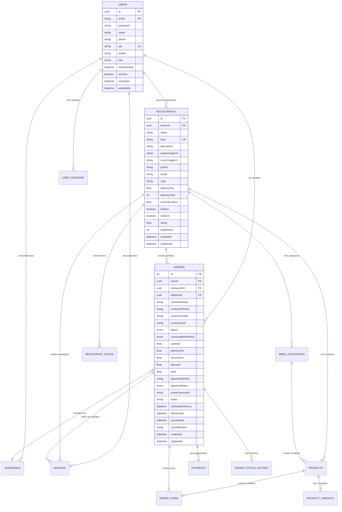

# 🗄️ Diagrama de Banco de Dados - E-commerce de Eletrônicos

<div align="center">
  <h2>💻 Loja de Eletrônicos e Periféricos de Computadores</h2>
  <p><em>Estrutura completa para e-commerce de tecnologia</em></p>
</div>

---

## 📋 Índice

- [🎯 Visão Geral](#-visão-geral)
- [👤 Módulo de Usuários](#-módulo-de-usuários)
- [🏪 Módulo de Lojas/Fornecedores](#-módulo-de-lojasfornecedores)
- [💻 Módulo de Produtos](#-módulo-de-produtos)
- [📱 Módulo de Categorias](#-módulo-de-categorias)
- [🛒 Módulo de Pedidos](#-módulo-de-pedidos)
- [💳 Módulo de Pagamentos](#-módulo-de-pagamentos)
- [📍 Módulo de Endereços](#-módulo-de-endereços)
- [⭐ Módulo de Avaliações](#-módulo-de-avaliações)
- [📦 Módulo de Estoque](#-módulo-de-estoque)
- [🔗 Relacionamentos](#-relacionamentos)
- [📊 Schema Prisma Completo](#-schema-prisma-completo)

---

## 🎯 Visão Geral

### 🌟 **Funcionalidades do Sistema:**

- 🔐 **Autenticação completa** (registro, login, perfil)
- 🏪 **Multi-loja/fornecedor** com gestão independente
- 🛒 **Carrinho de compras** persistente
- 💳 **Pagamentos** via Stripe e PIX
- 📍 **Múltiplos endereços** de entrega
- ⭐ **Sistema de avaliações** de produtos
- 📦 **Controle de estoque** em tempo real
- 🔍 **Busca avançada** por especificações
- 📱 **Comparação de produtos**
- 🏷️ **Sistema de cupons** e promoções
- 📊 **Dashboard** administrativo

---

## 👤 Módulo de Usuários

### **Tabela: users**

| Campo           | Tipo      | Descrição              | Restrições                    |
| --------------- | --------- | ---------------------- | ----------------------------- |
| `id`            | UUID      | ID único do usuário    | PK, Auto-gerado               |
| `email`         | String    | Email para login       | UNIQUE, NOT NULL              |
| `password`      | String    | Senha criptografada    | NOT NULL                      |
| `name`          | String    | Nome completo          | NOT NULL                      |
| `phone`         | String?   | Telefone               | OPTIONAL                      |
| `cpf`           | String?   | CPF do usuário         | UNIQUE, OPTIONAL              |
| `avatar`        | String?   | URL da foto            | OPTIONAL                      |
| `role`          | Enum      | Papel do usuário       | USER, ADMIN, RESTAURANT_OWNER |
| `emailVerified` | DateTime? | Data verificação email | OPTIONAL                      |
| `isActive`      | Boolean   | Conta ativa            | DEFAULT: true                 |
| `createdAt`     | DateTime  | Data de criação        | DEFAULT: now()                |
| `updatedAt`     | DateTime  | Última atualização     | AUTO UPDATE                   |

### **Tabela: user_sessions**

| Campo       | Tipo     | Descrição             | Restrições     |
| ----------- | -------- | --------------------- | -------------- |
| `id`        | UUID     | ID da sessão          | PK             |
| `userId`    | UUID     | Referência ao usuário | FK → users.id  |
| `token`     | String   | Token da sessão       | UNIQUE         |
| `expiresAt` | DateTime | Data de expiração     | NOT NULL       |
| `createdAt` | DateTime | Data de criação       | DEFAULT: now() |

---

## 🏪 Módulo de Lojas/Fornecedores

### **Tabela: stores**

| Campo            | Tipo     | Descrição           | Restrições     |
| ---------------- | -------- | ------------------- | -------------- |
| `id`             | UUID     | ID único da loja    | PK             |
| `ownerId`        | UUID     | Dono da loja        | FK → users.id  |
| `name`           | String   | Nome da loja        | NOT NULL       |
| `slug`           | String   | URL amigável        | UNIQUE         |
| `description`    | String   | Descrição           | NOT NULL       |
| `logoUrl`        | String   | Logo da loja        | NOT NULL       |
| `bannerUrl`      | String   | Banner da loja      | NOT NULL       |
| `phone`          | String   | Telefone            | NOT NULL       |
| `email`          | String   | Email de contato    | NOT NULL       |
| `cnpj`           | String?  | CNPJ                | OPTIONAL       |
| `website`        | String?  | Site da loja        | OPTIONAL       |
| `shippingFee`    | Float    | Taxa de envio       | DEFAULT: 0     |
| `freeShipping`   | Float    | Frete grátis acima  | DEFAULT: 0     |
| `processingTime` | Int      | Tempo processamento | DEFAULT: 1     |
| `isActive`       | Boolean  | Loja ativa          | DEFAULT: true  |
| `rating`         | Float    | Avaliação média     | DEFAULT: 0     |
| `totalSales`     | Int      | Total de vendas     | DEFAULT: 0     |
| `createdAt`      | DateTime | Data de criação     | DEFAULT: now() |
| `updatedAt`      | DateTime | Última atualização  | AUTO UPDATE    |

### **Tabela: brands**

| Campo       | Tipo     | Descrição          | Restrições     |
| ----------- | -------- | ------------------ | -------------- |
| `id`        | UUID     | ID da marca        | PK             |
| `name`      | String   | Nome da marca      | UNIQUE         |
| `slug`      | String   | URL amigável       | UNIQUE         |
| `logoUrl`   | String?  | Logo da marca      | OPTIONAL       |
| `website`   | String?  | Site oficial       | OPTIONAL       |
| `isActive`  | Boolean  | Marca ativa        | DEFAULT: true  |
| `createdAt` | DateTime | Data de criação    | DEFAULT: now() |
| `updatedAt` | DateTime | Última atualização | AUTO UPDATE    |

---

## 💻 Módulo de Produtos

### **Tabela: categories**

| Campo         | Tipo     | Descrição          | Restrições         |
| ------------- | -------- | ------------------ | ------------------ |
| `id`          | UUID     | ID da categoria    | PK                 |
| `parentId`    | UUID?    | Categoria pai      | FK → categories.id |
| `name`        | String   | Nome da categoria  | NOT NULL           |
| `slug`        | String   | URL amigável       | UNIQUE             |
| `description` | String?  | Descrição          | OPTIONAL           |
| `imageUrl`    | String?  | Imagem categoria   | OPTIONAL           |
| `iconUrl`     | String?  | Ícone categoria    | OPTIONAL           |
| `sortOrder`   | Int      | Ordem exibição     | DEFAULT: 0         |
| `isActive`    | Boolean  | Categoria ativa    | DEFAULT: true      |
| `createdAt`   | DateTime | Data de criação    | DEFAULT: now()     |
| `updatedAt`   | DateTime | Última atualização | AUTO UPDATE        |

**Exemplos de Categorias:**

- 💻 Computadores → Notebooks, Desktops, All-in-One
- 🖱️ Periféricos → Mouse, Teclado, Headset, Webcam
- 📱 Smartphones → Android, iPhone, Acessórios
- 🎮 Gaming → Placas de Vídeo, Consoles, Jogos
- 📺 Monitores → Gaming, Profissional, Ultrawide
- 🔧 Componentes → Processadores, Memória RAM, SSD

### **Tabela: products**

| Campo            | Tipo      | Descrição               | Restrições         |
| ---------------- | --------- | ----------------------- | ------------------ |
| `id`             | UUID      | ID do produto           | PK                 |
| `storeId`        | UUID      | Loja proprietária       | FK → stores.id     |
| `brandId`        | UUID      | Marca do produto        | FK → brands.id     |
| `categoryId`     | UUID      | Categoria               | FK → categories.id |
| `sku`            | String    | Código único            | UNIQUE             |
| `name`           | String    | Nome do produto         | NOT NULL           |
| `description`    | String    | Descrição detalhada     | NOT NULL           |
| `shortDesc`      | String?   | Descrição curta         | OPTIONAL           |
| `price`          | Float     | Preço atual             | NOT NULL           |
| `originalPrice`  | Float?    | Preço original          | OPTIONAL           |
| `costPrice`      | Float?    | Preço de custo          | OPTIONAL           |
| `images`         | String[]  | URLs das imagens        | ARRAY              |
| `specifications` | JSON      | Especificações técnicas | NOT NULL           |
| `warranty`       | String?   | Garantia                | OPTIONAL           |
| `weight`         | Float?    | Peso (kg)               | OPTIONAL           |
| `dimensions`     | JSON?     | Dimensões (L×A×P)       | OPTIONAL           |
| `isActive`       | Boolean   | Produto ativo           | DEFAULT: true      |
| `isFeatured`     | Boolean   | Produto em destaque     | DEFAULT: false     |
| `isOnSale`       | Boolean   | Em promoção             | DEFAULT: false     |
| `saleStartsAt`   | DateTime? | Início da promoção      | OPTIONAL           |
| `saleEndsAt`     | DateTime? | Fim da promoção         | OPTIONAL           |
| `rating`         | Float     | Avaliação média         | DEFAULT: 0         |
| `reviewCount`    | Int       | Total de avaliações     | DEFAULT: 0         |
| `soldCount`      | Int       | Quantidade vendida      | DEFAULT: 0         |
| `viewCount`      | Int       | Visualizações           | DEFAULT: 0         |
| `createdAt`      | DateTime  | Data de criação         | DEFAULT: now()     |
| `updatedAt`      | DateTime  | Última atualização      | AUTO UPDATE        |

### **Tabela: product_variants**

| Campo       | Tipo     | Descrição          | Restrições       |
| ----------- | -------- | ------------------ | ---------------- |
| `id`        | UUID     | ID da variação     | PK               |
| `productId` | UUID     | Produto pai        | FK → products.id |
| `name`      | String   | Nome variação      | "Cor", "Tamanho" |
| `value`     | String   | Valor variação     | "Preto", "16GB"  |
| `price`     | Float?   | Preço adicional    | OPTIONAL         |
| `sku`       | String?  | SKU específico     | OPTIONAL         |
| `stock`     | Int      | Estoque variação   | DEFAULT: 0       |
| `isActive`  | Boolean  | Variação ativa     | DEFAULT: true    |
| `createdAt` | DateTime | Data de criação    | DEFAULT: now()   |
| `updatedAt` | DateTime | Última atualização | AUTO UPDATE      |

---

## 📦 Módulo de Estoque

### **Tabela: inventory**

| Campo           | Tipo      | Descrição            | Restrições               |
| --------------- | --------- | -------------------- | ------------------------ |
| `id`            | UUID      | ID do estoque        | PK                       |
| `productId`     | UUID      | Produto              | FK → products.id         |
| `variantId`     | UUID?     | Variação específica  | FK → product_variants.id |
| `storeId`       | UUID      | Loja                 | FK → stores.id           |
| `quantity`      | Int       | Quantidade atual     | DEFAULT: 0               |
| `reserved`      | Int       | Quantidade reservada | DEFAULT: 0               |
| `minStock`      | Int       | Estoque mínimo       | DEFAULT: 0               |
| `maxStock`      | Int       | Estoque máximo       | DEFAULT: 1000            |
| `location`      | String?   | Localização física   | OPTIONAL                 |
| `lastRestocked` | DateTime? | Última reposição     | OPTIONAL                 |
| `createdAt`     | DateTime  | Data de criação      | DEFAULT: now()           |
| `updatedAt`     | DateTime  | Última atualização   | AUTO UPDATE              |

### **Tabela: stock_movements**

| Campo         | Tipo     | Descrição           | Restrições          |
| ------------- | -------- | ------------------- | ------------------- |
| `id`          | UUID     | ID do movimento     | PK                  |
| `inventoryId` | UUID     | Estoque             | FK → inventory.id   |
| `type`        | Enum     | Tipo movimento      | IN, OUT, ADJUSTMENT |
| `quantity`    | Int      | Quantidade          | NOT NULL            |
| `reason`      | String   | Motivo              | NOT NULL            |
| `reference`   | String?  | Referência externa  | OPTIONAL            |
| `userId`      | UUID?    | Usuário responsável | FK → users.id       |
| `createdAt`   | DateTime | Data do movimento   | DEFAULT: now()      |

---

## 🛒 Módulo de Pedidos

### **Tabela: orders**

| Campo               | Tipo      | Descrição           | Restrições                |
| ------------------- | --------- | ------------------- | ------------------------- |
| `id`                | Int       | ID do pedido        | PK, AUTO_INCREMENT        |
| `userId`            | UUID?     | Cliente (se logado) | FK → users.id             |
| `storeId`           | UUID      | Loja                | FK → stores.id            |
| `addressId`         | UUID?     | Endereço de entrega | FK → addresses.id         |
| `customerName`      | String    | Nome do cliente     | NOT NULL                  |
| `customerPhone`     | String    | Telefone do cliente | NOT NULL                  |
| `customerEmail`     | String?   | Email do cliente    | OPTIONAL                  |
| `customerCpf`       | String?   | CPF do cliente      | OPTIONAL                  |
| `status`            | Enum      | Status do pedido    | OrderStatus               |
| `shippingMethod`    | Enum      | Método envio        | STANDARD, EXPRESS, PICKUP |
| `subtotal`          | Float     | Subtotal produtos   | NOT NULL                  |
| `shippingFee`       | Float     | Taxa de envio       | DEFAULT: 0                |
| `serviceFee`        | Float     | Taxa de serviço     | DEFAULT: 0                |
| `discount`          | Float     | Desconto aplicado   | DEFAULT: 0                |
| `total`             | Float     | Valor total         | NOT NULL                  |
| `paymentMethod`     | String?   | Método pagamento    | "stripe", "pix", "cash"   |
| `paymentStatus`     | Enum      | Status pagamento    | PaymentStatus             |
| `stripePaymentId`   | String?   | ID pagamento Stripe | OPTIONAL                  |
| `notes`             | String?   | Observações         | OPTIONAL                  |
| `estimatedDelivery` | DateTime? | Previsão envio      | OPTIONAL                  |
| `shippedAt`         | DateTime? | Data do envio       | OPTIONAL                  |
| `deliveredAt`       | DateTime? | Data da entrega     | OPTIONAL                  |
| `cancelledAt`       | DateTime? | Data cancelamento   | OPTIONAL                  |
| `cancelReason`      | String?   | Motivo cancelamento | OPTIONAL                  |
| `createdAt`         | DateTime  | Data do pedido      | DEFAULT: now()            |
| `updatedAt`         | DateTime  | Última atualização  | AUTO UPDATE               |

### **Tabela: order_items**

| Campo            | Tipo     | Descrição        | Restrições       |
| ---------------- | -------- | ---------------- | ---------------- |
| `id`             | UUID     | ID do item       | PK               |
| `orderId`        | Int      | Pedido           | FK → orders.id   |
| `productId`      | UUID     | Produto          | FK → products.id |
| `quantity`       | Int      | Quantidade       | NOT NULL         |
| `unitPrice`      | Float    | Preço unitário   | NOT NULL         |
| `totalPrice`     | Float    | Preço total      | NOT NULL         |
| `customizations` | JSON?    | Personalizações  | OPTIONAL         |
| `notes`          | String?  | Observações item | OPTIONAL         |
| `createdAt`      | DateTime | Data de criação  | DEFAULT: now()   |

### **Tabela: order_status_history**

| Campo       | Tipo     | Descrição         | Restrições     |
| ----------- | -------- | ----------------- | -------------- |
| `id`        | UUID     | ID do histórico   | PK             |
| `orderId`   | Int      | Pedido            | FK → orders.id |
| `status`    | Enum     | Status            | OrderStatus    |
| `notes`     | String?  | Observações       | OPTIONAL       |
| `changedBy` | UUID?    | Quem alterou      | FK → users.id  |
| `createdAt` | DateTime | Data da alteração | DEFAULT: now() |

---

## 💳 Módulo de Pagamentos

### **Tabela: payments**

| Campo                | Tipo      | Descrição          | Restrições              |
| -------------------- | --------- | ------------------ | ----------------------- |
| `id`                 | UUID      | ID do pagamento    | PK                      |
| `orderId`            | Int       | Pedido             | FK → orders.id          |
| `method`             | String    | Método pagamento   | "stripe", "pix", "cash" |
| `amount`             | Float     | Valor              | NOT NULL                |
| `status`             | Enum      | Status             | PaymentStatus           |
| `stripePaymentId`    | String?   | ID Stripe          | OPTIONAL                |
| `stripeClientSecret` | String?   | Client Secret      | OPTIONAL                |
| `pixCode`            | String?   | Código PIX         | OPTIONAL                |
| `pixExpiresAt`       | DateTime? | PIX expira em      | OPTIONAL                |
| `paidAt`             | DateTime? | Data do pagamento  | OPTIONAL                |
| `failedAt`           | DateTime? | Data da falha      | OPTIONAL                |
| `failureReason`      | String?   | Motivo da falha    | OPTIONAL                |
| `createdAt`          | DateTime  | Data de criação    | DEFAULT: now()          |
| `updatedAt`          | DateTime  | Última atualização | AUTO UPDATE             |

---

## 📍 Módulo de Endereços

### **Tabela: addresses**

| Campo          | Tipo     | Descrição            | Restrições         |
| -------------- | -------- | -------------------- | ------------------ |
| `id`           | UUID     | ID do endereço       | PK                 |
| `userId`       | UUID?    | Usuário proprietário | FK → users.id      |
| `label`        | String   | Rótulo               | "Casa", "Trabalho" |
| `street`       | String   | Rua                  | NOT NULL           |
| `number`       | String   | Número               | NOT NULL           |
| `complement`   | String?  | Complemento          | OPTIONAL           |
| `neighborhood` | String   | Bairro               | NOT NULL           |
| `city`         | String   | Cidade               | NOT NULL           |
| `state`        | String   | Estado               | NOT NULL           |
| `zipCode`      | String   | CEP                  | NOT NULL           |
| `country`      | String   | País                 | DEFAULT: "Brasil"  |
| `latitude`     | Float?   | Latitude             | OPTIONAL           |
| `longitude`    | Float?   | Longitude            | OPTIONAL           |
| `isDefault`    | Boolean  | Endereço padrão      | DEFAULT: false     |
| `createdAt`    | DateTime | Data de criação      | DEFAULT: now()     |
| `updatedAt`    | DateTime | Última atualização   | AUTO UPDATE        |

---

## ⭐ Módulo de Avaliações

### **Tabela: reviews**

| Campo             | Tipo      | Descrição            | Restrições          |
| ----------------- | --------- | -------------------- | ------------------- |
| `id`              | UUID      | ID da avaliação      | PK                  |
| `userId`          | UUID      | Usuário avaliador    | FK → users.id       |
| `orderId`         | Int       | Pedido avaliado      | FK → orders.id      |
| `restaurantId`    | UUID      | Restaurante          | FK → restaurants.id |
| `rating`          | Int       | Nota (1-5)           | 1 ≤ rating ≤ 5      |
| `comment`         | String?   | Comentário           | OPTIONAL            |
| `deliveryRating`  | Int?      | Nota entrega         | 1 ≤ rating ≤ 5      |
| `foodRating`      | Int?      | Nota comida          | 1 ≤ rating ≤ 5      |
| `serviceRating`   | Int?      | Nota atendimento     | 1 ≤ rating ≤ 5      |
| `isPublic`        | Boolean   | Avaliação pública    | DEFAULT: true       |
| `restaurantReply` | String?   | Resposta restaurante | OPTIONAL            |
| `repliedAt`       | DateTime? | Data da resposta     | OPTIONAL            |
| `createdAt`       | DateTime  | Data da avaliação    | DEFAULT: now()      |
| `updatedAt`       | DateTime  | Última atualização   | AUTO UPDATE         |

---

## 🔗 Relacionamentos



---

## 📊 Schema Prisma Completo

```prisma
// This is your Prisma schema file,
// learn more about it in the docs: https://pris.ly/d/prisma-schema

generator client {
  provider = "prisma-client-js"
}

datasource db {
  provider  = "postgresql"
  url       = env("DATABASE_URL")
  directUrl = env("DIRECT_URL")
}

// ===================================
// 👤 MÓDULO DE USUÁRIOS
// ===================================

model User {
  id            String    @id @default(uuid())
  email         String    @unique
  password      String
  name          String
  phone         String?
  cpf           String?   @unique
  avatar        String?
  role          UserRole  @default(USER)
  emailVerified DateTime?
  isActive      Boolean   @default(true)
  createdAt     DateTime  @default(now())
  updatedAt     DateTime  @updatedAt

  // Relacionamentos
  sessions    UserSession[]
  restaurants Restaurant[]
  addresses   Address[]
  orders      Order[]
  reviews     Review[]

  @@map("users")
}

model UserSession {
  id        String   @id @default(uuid())
  userId    String
  token     String   @unique
  expiresAt DateTime
  createdAt DateTime @default(now())

  user User @relation(fields: [userId], references: [id], onDelete: Cascade)

  @@map("user_sessions")
}

enum UserRole {
  USER
  ADMIN
  RESTAURANT_OWNER
}

// ===================================
// 🏪 MÓDULO DE RESTAURANTES
// ===================================

model Restaurant {
  id             String  @id @default(uuid())
  ownerId        String
  name           String
  slug           String  @unique
  description    String
  avatarImageUrl String
  coverImageUrl  String
  phone          String
  email          String
  cnpj           String?
  deliveryFee    Float   @default(0)
  deliveryTime   Int // em minutos
  minOrderValue  Float   @default(0)
  isOpen         Boolean @default(true)
  isActive       Boolean @default(true)
  rating         Float   @default(0)
  totalOrders    Int     @default(0)
  createdAt      DateTime @default(now())
  updatedAt      DateTime @updatedAt

  // Relacionamentos
  owner          User               @relation(fields: [ownerId], references: [id], onDelete: Cascade)
  menuCategories MenuCategory[]
  products       Product[]
  orders         Order[]
  reviews        Review[]
  hours          RestaurantHours[]

  @@map("restaurants")
}

model RestaurantHours {
  id           String @id @default(uuid())
  restaurantId String
  dayOfWeek    Int // 0 = Domingo, 1 = Segunda, ..., 6 = Sábado
  openTime     String // "08:00"
  closeTime    String // "22:00"
  isClosed     Boolean @default(false)

  restaurant Restaurant @relation(fields: [restaurantId], references: [id], onDelete: Cascade)

  @@map("restaurant_hours")
}

// ===================================
// 🍔 MÓDULO DE PRODUTOS
// ===================================

model MenuCategory {
  id           String  @id @default(uuid())
  restaurantId String
  name         String
  description  String?
  imageUrl     String?
  sortOrder    Int     @default(0)
  isActive     Boolean @default(true)
  createdAt    DateTime @default(now())
  updatedAt    DateTime @updatedAt

  // Relacionamentos
  restaurant Restaurant @relation(fields: [restaurantId], references: [id], onDelete: Cascade)
  products   Product[]

  @@map("menu_categories")
}

model Product {
  id               String   @id @default(uuid())
  restaurantId     String
  menuCategoryId   String
  name             String
  description      String
  price            Float
  imageUrl         String
  ingredients      String[]
  allergens        String[]
  nutritionalInfo  Json?
  preparationTime  Int      @default(15)
  isAvailable      Boolean  @default(true)
  isPopular        Boolean  @default(false)
  sortOrder        Int      @default(0)
  rating           Float    @default(0)
  totalSold        Int      @default(0)
  createdAt        DateTime @default(now())
  updatedAt        DateTime @updatedAt

  // Relacionamentos
  restaurant   Restaurant      @relation(fields: [restaurantId], references: [id], onDelete: Cascade)
  menuCategory MenuCategory    @relation(fields: [menuCategoryId], references: [id], onDelete: Cascade)
  orderItems   OrderItem[]
  variants     ProductVariant[]

  @@map("products")
}

model ProductVariant {
  id          String  @id @default(uuid())
  productId   String
  name        String // "Tamanho", "Sabor", "Adicionais"
  options     Json // ["P", "M", "G"] ou [{"name": "Queijo Extra", "price": 2.50}]
  required    Boolean @default(false)
  multiSelect Boolean @default(false)

  product Product @relation(fields: [productId], references: [id], onDelete: Cascade)

  @@map("product_variants")
}

// ===================================
// 🛒 MÓDULO DE PEDIDOS
// ===================================

model Order {
  id                 Int                @id @default(autoincrement())
  userId             String?
  restaurantId       String
  addressId          String?
  customerName       String
  customerPhone      String
  customerEmail      String?
  customerCpf        String?
  status             OrderStatus
  consumptionMethod  ConsumptionMethod
  subtotal           Float
  deliveryFee        Float             @default(0)
  serviceFee         Float             @default(0)
  discount           Float             @default(0)
  total              Float
  paymentMethod      String?
  paymentStatus      PaymentStatus     @default(PENDING)
  stripePaymentId    String?
  notes              String?
  estimatedDelivery  DateTime?
  deliveredAt        DateTime?
  cancelledAt        DateTime?
  cancelReason       String?
  createdAt          DateTime          @default(now())
  updatedAt          DateTime          @updatedAt

  // Relacionamentos
  user         User?               @relation(fields: [userId], references: [id])
  restaurant   Restaurant          @relation(fields: [restaurantId], references: [id], onDelete: Cascade)
  address      Address?            @relation(fields: [addressId], references: [id])
  items        OrderItem[]
  payments     Payment[]
  statusHistory OrderStatusHistory[]
  reviews      Review[]

  @@map("orders")
}

model OrderItem {
  id            String   @id @default(uuid())
  orderId       Int
  productId     String
  quantity      Int
  unitPrice     Float
  totalPrice    Float
  customizations Json?
  notes         String?
  createdAt     DateTime @default(now())

  // Relacionamentos
  order   Order   @relation(fields: [orderId], references: [id], onDelete: Cascade)
  product Product @relation(fields: [productId], references: [id], onDelete: Cascade)

  @@map("order_items")
}

model OrderStatusHistory {
  id        String      @id @default(uuid())
  orderId   Int
  status    OrderStatus
  notes     String?
  changedBy String?
  createdAt DateTime    @default(now())

  // Relacionamentos
  order Order @relation(fields: [orderId], references: [id], onDelete: Cascade)
  user  User? @relation(fields: [changedBy], references: [id])

  @@map("order_status_history")
}

enum OrderStatus {
  PENDING          // Pendente
  CONFIRMED        // Confirmado
  PREPARING        // Em preparo
  READY_FOR_PICKUP // Pronto para retirada
  OUT_FOR_DELIVERY // Saiu para entrega
  DELIVERED        // Entregue
  CANCELLED        // Cancelado
}

enum ConsumptionMethod {
  DELIVERY // Entrega
  PICKUP   // Retirada
  DINE_IN  // Comer no local
}

enum PaymentStatus {
  PENDING   // Pendente
  PAID      // Pago
  FAILED    // Falhou
  REFUNDED  // Reembolsado
  CANCELLED // Cancelado
}

// ===================================
// 💳 MÓDULO DE PAGAMENTOS
// ===================================

model Payment {
  id                 String        @id @default(uuid())
  orderId            Int
  method             String // "stripe", "pix", "cash"
  amount             Float
  status             PaymentStatus
  stripePaymentId    String?
  stripeClientSecret String?
  pixCode            String?
  pixExpiresAt       DateTime?
  paidAt             DateTime?
  failedAt           DateTime?
  failureReason      String?
  createdAt          DateTime      @default(now())
  updatedAt          DateTime      @updatedAt

  // Relacionamentos
  order Order @relation(fields: [orderId], references: [id], onDelete: Cascade)

  @@map("payments")
}

// ===================================
// 📍 MÓDULO DE ENDEREÇOS
// ===================================

model Address {
  id           String  @id @default(uuid())
  userId       String?
  label        String // "Casa", "Trabalho", "Outros"
  street       String
  number       String
  complement   String?
  neighborhood String
  city         String
  state        String
  zipCode      String
  country      String  @default("Brasil")
  latitude     Float?
  longitude    Float?
  isDefault    Boolean @default(false)
  createdAt    DateTime @default(now())
  updatedAt    DateTime @updatedAt

  // Relacionamentos
  user   User?   @relation(fields: [userId], references: [id], onDelete: Cascade)
  orders Order[]

  @@map("addresses")
}

// ===================================
// ⭐ MÓDULO DE AVALIAÇÕES
// ===================================

model Review {
  id               String    @id @default(uuid())
  userId           String
  orderId          Int
  restaurantId     String
  rating           Int // 1-5
  comment          String?
  deliveryRating   Int? // 1-5
  foodRating       Int? // 1-5
  serviceRating    Int? // 1-5
  isPublic         Boolean   @default(true)
  restaurantReply  String?
  repliedAt        DateTime?
  createdAt        DateTime  @default(now())
  updatedAt        DateTime  @updatedAt

  // Relacionamentos
  user       User       @relation(fields: [userId], references: [id], onDelete: Cascade)
  order      Order      @relation(fields: [orderId], references: [id], onDelete: Cascade)
  restaurant Restaurant @relation(fields: [restaurantId], references: [id], onDelete: Cascade)

  @@unique([userId, orderId]) // Um usuário pode avaliar um pedido apenas uma vez
  @@map("reviews")
}
```

---

## 🎯 **Próximos Passos:**

### **1. 📝 Implementar Schema:**

```bash
# Copie o schema acima para prisma/schema.prisma
# Execute as migrations
npx prisma migrate dev --name ecommerce_complete

# Gerar cliente
npx prisma generate
```

### **2. 🌱 Criar Seeds:**

- Usuários de exemplo
- Restaurantes com produtos
- Categorias e produtos variados
- Endereços de teste

### **3. 🔐 Implementar Autenticação:**

- NextAuth.js ou Auth0
- Middleware de proteção
- Roles e permissões

### **4. 🛒 Sistema de Carrinho:**

- Context do carrinho
- Persistência local
- Sincronização com usuário

---

<div align="center">
  <h3>🚀 Agora você tem a estrutura completa para seu e-commerce!</h3>
  <p><strong>Bora codar! 💻</strong></p>
</div>
